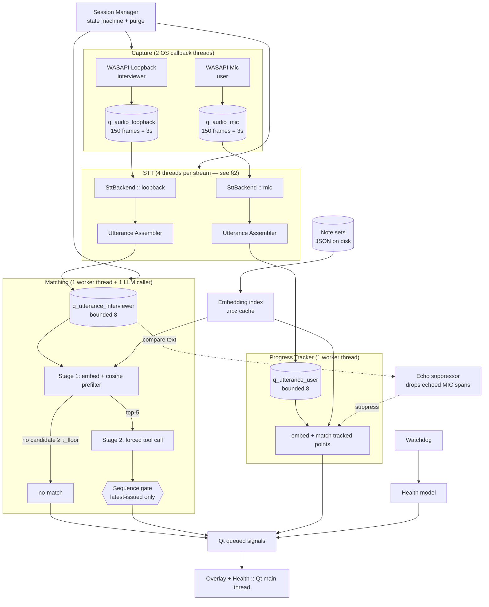
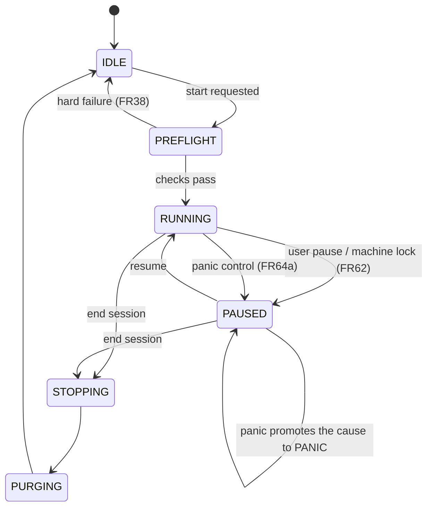

# Technical Design

Cites decisions from [`00-decisions-and-assumptions.md`](./00-decisions-and-assumptions.md) and
requirements from [`01-requirements.md`](./01-requirements.md).

---

## 1. Component Architecture



### Module layout

```
interview_prep_recall/
  app.py                    # entry point, DI wiring
  session/
    manager.py              # state machine (§6), purge, panic clear
    health.py               # health model (§7)
    preflight.py            # FR38 readiness checks
  audio/
    capture.py              # pyaudiowpatch loopback + mic
    devices.py              # enumeration, default-change notifications (FR39)
    echo.py                 # cross-correlation detector (FR57)
  stt/
    interface.py            # SttBackend Protocol + event types (§2) — WRITTEN FIRST
    assembler.py            # utterance assembly (§3)
    local_whisper.py        # faster-whisper backend
    deepgram.py             # cloud backend (own asyncio loop)
    elevenlabs.py           # cloud backend (own asyncio loop)
  notes/
    model.py                # NoteSet / Note dataclasses
    store.py                # atomic write, rotation, schema version (§4)
    importer.py             # chunking, bullet proposal
    index.py                # embedding cache, model-version guard
  matching/
    prefilter.py            # stage 1
    selector.py             # stage 2, forced tool call
    pipeline.py             # sequence gate, debounce, fallback (§5)
  tracker/
    progress.py             # FR12 / FR56
  ui/
    overlay.py              # frameless always-on-top, capture exclusion
    editor.py               # notes CRUD
    settings.py
    indicators.py           # FR20 egress, FR35 health
  diagnostics/
    ring.py                 # FR36 in-memory ring buffer
  watchdog.py               # heartbeats, health derivation, device notifications (COM MTA)
  platform/
    win_capture_exclusion.py  # SetWindowDisplayAffinity via ctypes
    win_wer.py                # disable WER dumps (FR16)
    credentials.py            # keyring wrapper (FR19)
```

---

## 1a. Audio Contract *(closes review-B A1 — the highest-divergence ambiguity)*

Without this, "bounded (3 chunks)" and "copies the frame" describe buffers ~400× apart, and
FR33's overflow test means opposite things.

| Property | Value |
|---|---|
| Capture format | Device-native, converted immediately in the callback |
| Queue element | **One 20 ms frame**, 16 kHz mono `int16` (640 bytes) |
| `q_audio_*` depth | **150 frames = 3 s** of jitter buffer |
| Overflow unit | One 20 ms frame (FR45) — not a chunk, not a question |
| Resampling | In the **capture callback**, via `soxr` (fast, fixed-cost). The callback stays under the FR45 p99 2 ms budget because `soxr` on a 20 ms frame is tens of microseconds |
| `feed(pcm: bytes)` | **Exactly one 20 ms frame.** Backends never resample and never receive a larger buffer |
| STT chunking (FR8) | **Inside the backend.** The pump passes frames straight through; each backend buffers internally to whatever its inference or wire protocol wants — local aggregates to 2–4 s windows, cloud streams frames onto the socket as they arrive |

**Why the callback resamples rather than the worker:** it keeps a single format in every queue,
every backend, and every fixture, so a WAV fixture fed directly to `feed()` exercises the same
path as live audio — which is what makes CI-without-audio-hardware possible (§12).

**Why `feed()` takes a 20 ms frame rather than a 2–4 s chunk.** Both readings were defensible and
an earlier draft contained each in a different section. Frames win for three reasons:

1. **Cloud backends need frames.** Streaming 20 ms frames onto a WebSocket is what Deepgram and
   ElevenLabs are built for. Handing them 3 s blobs would add seconds of avoidable latency on the
   path whose entire selling point is sub-300 ms.
2. **The 900 ms inference-tail budget (§9a) is unreachable otherwise.** If inference cannot start
   until a 2–4 s window closes, the tail is bounded below by the window, not by the model.
3. **Chunking is a backend concern.** Local Whisper wants windows; cloud wants frames. Pushing
   aggregation behind the interface is what lets one conformance suite (T2.1) cover both.

Consequence: **FR8's "~2–4 s rolling chunks" describes the local backend's internal window, not
the interface.** The pump never aggregates.

---

## 2. The STT Interface *(D-2 — written before any backend)*

This is the contract BC-4/A8 said was missing. It is specified against the **local** backend's
constraints, because local Whisper cannot provide things cloud backends give for free
(server-side finalization, native interim results), and an interface shaped by cloud would not
be implementable locally.

```python
class SttStreamState(Enum):
    STARTING = auto()
    READY = auto()
    DEGRADED = auto()
    RECONNECTING = auto()
    FAILED = auto()
    STOPPED = auto()


@dataclass(frozen=True)
class TranscriptEvent:
    stream_id: str  # "interviewer" | "user"
    text: str
    is_final: bool
    t_start: float  # seconds, monotonic, relative to start()
    t_end: float
    confidence: float | None
    backend: str


@dataclass(frozen=True)
class StateEvent:
    stream_id: str
    state: SttStreamState
    detail: str | None


class SttBackend(Protocol):
    name: str
    supports_interim: bool

    def start(
        self,
        stream_id: str,
        sample_rate: int,
        channels: int,
        on_transcript: Callable[[TranscriptEvent], None],
        on_state: Callable[[StateEvent], None],
    ) -> None: ...
    def feed(self, pcm: bytes, t_capture: float) -> None: ...
    def stop(self, flush_timeout_s: float = 2.0) -> None: ...
    def close(self) -> None: ...
```

### Semantic contract — binding on every backend

1. **`feed()` never blocks and never raises on transient errors.** It enqueues and returns. A
   backend that cannot keep up drops internally and reports `DEGRADED`. Violating this stalls
   the audio callback and breaks FR45.
2. **Finalization is guaranteed.** Every span of audio the backend acknowledged produces exactly
   one `is_final=True` event, or the stream transitions to `FAILED`. No span is silently dropped.
   (FR47.)
3. **Interim events are advisory.** Backends may emit `is_final=False`; consumers must never
   trigger matching on them. `supports_interim=False` is legal.
4. **Ordering.** For a given `stream_id`, events are emitted in non-decreasing `t_start`.
5. **Clock.** All timestamps derive from `time.monotonic()` at capture time, propagated through
   `feed(t_capture)`. Backends must not use wall-clock or their own arrival time — cloud latency
   would otherwise corrupt utterance boundaries.
6. **`stop()`** flushes pending finals within `flush_timeout_s`, then transitions to `STOPPED`.
   **`close()`** releases resources and is idempotent.
7. **Callbacks run on whichever thread the backend chooses**, which is not necessarily the caller
   of `feed()`. Consumers must not do heavy work in them; they enqueue and return.

### Thread ownership — normative *(closes review-B A2)*

Rules 1 and 7 make the backend, not the caller, responsible for its own execution. The resulting
ownership is fixed, not left to the implementer:

| Stage | Thread | Notes |
|---|---|---|
| `feed()` caller | STT **pump** thread (1 per stream) | Dequeues frames, calls `feed()`, does nothing else |
| Inference / socket I/O | **Backend-internal** thread, created and owned by the backend | Local: inference loop. Cloud: private asyncio loop (D-1) |
| `on_transcript` / `on_state` | Backend-internal thread | Must return immediately |
| Utterance assembly | **Assembler** thread (1 per stream) | Fed by a bounded `q_transcript_<stream>` (depth 32) that the callback writes to |

This is **4 threads per stream** (pump, backend-internal, assembler, plus the OS capture callback),
not the 2 the earlier §8 table implied. `q_transcript_*` is the fourth queue class and was
previously unnamed. The assembler owns its accumulation state exclusively — no lock needed,
because exactly one thread touches it.

**Utterance close timer (closes review-B "missing #17"):** the assembler thread waits on its queue
with a timeout equal to the remaining silence budget, so a trailing utterance closes even when no
further events arrive. No separate timer thread exists, and none is needed.

**Local backend note (FR47):** `faster-whisper` has no native finalization, so `local_whisper.py`
runs a VAD-based silence detector and synthesizes `is_final=True` at ≥700 ms silence or 10 s max
span. This is the reason the interface defines finalization as a backend responsibility rather
than assuming the wire protocol supplies it.

---

## 3. Utterance Assembly *(D-4 / FR46)*

```
final TranscriptEvents ──► [assembler] ──► Utterance
```

- Accumulate consecutive `is_final` events on a stream.
- Close the utterance on: ≥700 ms gap since `t_end`, OR accumulated span ≥10 s, OR session stop.
- **Merge forward** if the closed utterance has <3 words or <12 characters: hold the fragment and
  prepend it to the next utterance on that stream. *(Closes review-B A5 — "discard-and-merge-forward"
  named two different operations.)* Precisely:
  - The held fragment is prepended to the next utterance, which is then re-tested against the
    minimum.
  - A fragment held longer than **30 s** is dropped — an isolated "mm" is never worth carrying into
    an unrelated question.
  - At session stop, a held fragment is **dropped, not emitted**. Firing a match on "why?" as the
    session ends serves nobody.
  - Consequence worth stating: short but meaningful questions — "Why?", "Tell me more" — do not
    trigger matching on their own. They merge into the next utterance instead. This is deliberate;
    such fragments carry too little signal for the embedding to place them.
- Emit `Utterance(stream_id, text, t_start, t_end, context)` where `context` is up to 10 s of
  preceding finalized text on the same stream. **`context` is used only in the stage-2 prompt,
  never in the stage-1 embedding** — including it in the embedding blurs the query and measurably
  hurts prefilter precision.

Rationale for these constants is empirical and they are config-exposed; M4 tunes them against
recorded fixtures.

---

## 4. Data Model *(D-3)*

### On-disk layout

```
%APPDATA%\InterviewPrepRecall\
  config.json                              # thresholds, backend choice, model ID (D-9)
  notesets\<uuid>.json                     # one note set
  notesets\<uuid>.json.bak.1 … .bak.5      # rotation (FR29)
  index\<uuid>.<embed_model_slug>.npz     # embedding cache (FR34)
  consent.json                             # FR63 acknowledgement
```

### Settings split — normative *(review-B: previously ambiguous)*

| Setting | Home |
|---|---|
| Overlay position, size, opacity, lock state (FR22–27) | `QSettings` (registry) |
| Active note set ID (FR43) | `QSettings` |
| τ_floor / sensitivity (FR52), backend choice, `llm_model_id`, `embed_model_id`, all other thresholds | `config.json` |

`config.json` carries its own `schema_version`; a missing, unparseable, or newer-versioned file is
replaced with defaults and the user is notified — it holds no irreplaceable data, so recovery is
preferable to refusal (unlike notes, FR31).

**Backward migration (review-B "missing #10"):** the store reads any `schema_version` ≤ current.
Migrations are forward-only functions `migrate_v{n}_to_v{n+1}`, applied in sequence on load, with
the pre-migration file preserved as `.bak.1` before any write. v1 ships with none, but the hook
exists from the start — retrofitting a migration path onto a format already in users' hands is how
data gets lost.

### Write allowlist *(corrects "nothing else is ever written" — review-B C5)*

The FR16 gate checks **session-time writes**. The complete allowlist:

| Path | Written by |
|---|---|
| `%APPDATA%\InterviewPrepRecall\**` | The app |
| `QSettings` registry keys | Qt |
| PyInstaller `_MEI*` temp dir | Bootloader, at startup |
| `faster-whisper` model cache | First run only |
| **HuggingFace / torch cache (`%USERPROFILE%\.cache\huggingface`, `%LOCALAPPDATA%\torch`)** | `sentence-transformers`, first run only |

The last row was missing and would have failed the FR16 gate on any correct first run for reasons
unrelated to privacy.

**User-initiated exports (FR30 notes, FR36 diagnostics) write wherever the user chooses and are
outside this allowlist by design.** They are excluded from the gate because the gate measures what
the app does *on its own* during a session; an export is the user exercising a requirement. The
gate procedure runs without invoking either export.

UI geometry/opacity → `QSettings` (registry) per FR26. API keys → Credential Manager per FR19,
service name `InterviewPrepRecall`, account = backend name (`deepgram`, `elevenlabs`, `anthropic`).
The Anthropic key for stage-2 matching is covered by FR19 exactly as the STT keys are.

### Note set schema (`schema_version: 1`)

**This section is the pre-M10 schema and is out of date.** `07-context-sources-and-report.md`
§5 lists "data model gains `SourceKind` and `ContextSet`" as a required amendment here; M10
shipped (see `06-progress.md`) but this section was never rewritten. See
`07-context-sources-and-report.md` §2 for the v2 shape and the v1→v2 migration rule.

```json
{
  "schema_version": 1,
  "id": "9f2c…",
  "name": "Acme — Senior PM",
  "created_at": "2026-08-08T12:00:00Z",
  "updated_at": "2026-08-08T12:30:00Z",
  "notes": [
    {
      "id": "3a71…",
      "headline": "Tell me about a time you handled conflict",
      "bullets": ["Design review deadlock, Q3", "Ran a written trade-off doc", "Shipped 2 weeks early"],
      "body": "Full prepared answer, verbatim, as the user wrote it…",
      "tags": ["conflict", "leadership"],
      "order_index": 0,
      "track_progress": true,
      "created_at": "…", "updated_at": "…"
    }
  ]
}
```

- `id` — UUID4, stable, never reused (FR41).
- `bullets` — user-authored or user-confirmed verbatim strings (FR42). Empty list is legal and
  triggers the D-6 truncation path.
- `track_progress` — selects membership in the FR12 checklist.

### Embedding cache

`.npz` holding `note_ids`, `vectors` (float32, L2-normalized), `content_hashes`, plus attributes
`schema_version`, `embed_model_id`, `embed_model_version`, `embedded_at`.

**Naming, and why it changed:** `model_id` previously named both the Anthropic model (D-9) and the
embedding model in the same document, and appeared in a filename. Hugging Face IDs contain `/`
(`sentence-transformers/all-MiniLM-L6-v2`), which is illegal in a Windows filename — the path as
written would not construct. The file now uses `embed_model_slug`, the ID with `/` and `:`
replaced by `_`; the unmodified ID is kept in the `embed_model_id` attribute, which is what FR34's
mismatch check compares. A corrupt or unreadable `.npz` is deleted and rebuilt — it is derived
data, so there is nothing to recover.

**Embedded text is `headline` only** *(review-B: previously unstated)*. Matching is
question-to-question: the headline *is* the anticipated question, while `body` is the prepared
answer and `bullets` are its glanceable form. Embedding the answer text pulls the vector toward
topic vocabulary the interviewer will not use when asking.

**`content_hash` = SHA-256 of the exact embedded text**, i.e. `headline` — the hash must cover
precisely what was embedded and nothing else. An earlier draft hashed `headline + "\x00" + body`
while implying a different embedding input; that mismatch would either re-embed on irrelevant edits
or, worse, miss edits to the embedded field, silently reintroducing the BC-1 stale-vector failure
that FR34 exists to prevent.

**Load rule (FR34):** if `embed_model_id`/`embed_model_version` mismatch the running model, discard the cache
and re-embed everything. Per note, if `content_hash` differs, re-embed that note. This closes
BC-1's silent-degradation path — the failure mode where stale vectors are compared against fresh
ones and matching quietly gets worse with no error.

### Atomic write (FR28)

```
tmp = target.with_suffix(".tmp")
write(tmp); flush(); os.fsync(fd); close()

# rotate by COPY, oldest first — target is never renamed away
for n in (4, 3, 2, 1):
    if exists(f"{target}.bak.{n}"): copy(f"{target}.bak.{n}", f"{target}.bak.{n+1}")
if exists(target): copy(target, f"{target}.bak.1")   # copy, not rename

os.replace(tmp, target)         # atomic on NTFS
```

**Rotation copies rather than renames** *(review-B2 item 8)*. An earlier version renamed
`target → .bak.1`, which leaves a window where no live file exists — directly contradicting the
rationale it was written to support. Since this sits on the review's highest-severity finding
(notes are the only irreplaceable asset), the extra copy is worth its cost: a crash at any point
leaves either the old file or the new one intact, never neither.

---

## 5. Matching Pipeline *(§5 of requirements)*

```
Utterance(interviewer)
  → embed (all-MiniLM-L6-v2, normalized)
  → cosine vs active-set vectors
  → candidates = top-5 where sim ≥ τ_floor
  → if empty:  emit NoMatch                                    [FR50]
  → else:      seq = next_sequence(); dispatch stage 2         [FR32]
                 ↓
       forced tool call, enum = [*candidate_ids, "none"]        [FR48]
                 ↓
       on success  → if note_id == "none": NoMatch
                     else: Match(note_id, seq, CONFIRMED)
       on failure  → if top_candidate.sim ≥ τ_degraded:
                          Match(top_id, seq, DEGRADED)          [FR49]
                     else: NoMatch
                 ↓
       sequence gate: render only if seq == latest_issued       [FR32]
```

### Thresholds (initial values, tuned in M4)

| Symbol | Default | Meaning |
|---|---|---|
| `τ_floor` | 0.35 | Stage-1 admission. Exposed to the user as the FR52 sensitivity control, range **0.20–0.60**. |
| `τ_degraded` | `max(0.55, τ_floor + 0.10)` | Minimum similarity to render a degraded fallback (FR49). **Derived, not independent** — a fixed 0.55 would fall below τ_floor once the user raised sensitivity past 0.55, making the degraded gate unconditional and silently restoring the PRD behaviour D-U3 exists to overturn. *(Closes review-B A8.)* |
| `τ_track` | 0.60 | Progress-tracker "mentioned" threshold (FR12). Deliberately stricter than τ_floor: a false "you covered that" is worse than a missed tick, because the user acts on it by *not* saying something. *(Closes review-B "missing #7".)* |
| `K` | 5 | Max candidates into stage 2 (bounds FR48's enum). |
| `τ_visible` | 25 s | Snippet auto-clear (FR54). |
| `τ_echo` | 0.70 | Normalised cross-correlation above which mic/loopback are judged to be the same signal (FR57). |
| `debounce` | 1 in flight | D-11. |

### Stage-2 request specification *(closes review-B A3)*

T4.7 is a gate that can delete the LLM stage from the architecture, and its outcome is dominated
by the prompt. Leaving the prompt to the implementer means the gate measures the implementer, not
the design.

- **Model:** `config.llm_model_id`, default `claude-haiku-4-5-20251001` (D-9).
- **`max_tokens`:** 50. **`temperature`:** 0.
- **`tool_choice`:** `{"type": "tool", "name": "select_note"}` — forced (FR10).
- **Enum:** candidate IDs only, plus `"none"` (FR48).
- **Candidate serialisation:** for each candidate, `id`, `headline`, and `tags`. **Not `body`** —
  bodies are prepared *answers*, and matching is question-to-question; including them adds
  hundreds of tokens per call and biases selection toward long notes.
- **User message:**

```
Recent conversation (context only, do not match against this):
{utterance.context}

The interviewer just asked:
{utterance.text}

Candidate prepared notes:
{for each: "- id={id} | {headline} | tags: {tags}"}
```

- **System prompt:** *"You match a live interview question to the candidate's own prepared notes.
  Select the single note that answers what was just asked. If none of them genuinely addresses the
  question, select \"none\". Prefer \"none\" over a weak match — a wrong note shown mid-interview
  is worse than no note."*

The `"none"`-biasing instruction is deliberate and paired with the structural constraint: FR10
guarantees the model *cannot* fabricate, and this prompt discourages it from over-selecting. Any
change to this block invalidates T4.7's measurement and must be re-run.

### The sequence gate — precise semantics (FR32)

```python
# Owned exclusively by the matching worker thread. LLM pool threads never mutate it;
# they post results onto `q_match_results` (bounded 4), which the matching worker drains here.
self._session_nonce: uuid.UUID  # regenerated on every session start AND every purge
self._latest_issued: int  # incremented at dispatch


def on_result(result):
    if result.nonce != self._session_nonce or result.seq != self._latest_issued:
        diagnostics.record("stale_response_discarded", seq=result.seq)
        return  # superseded, or belongs to a purged session
    render(result)
```

Two properties, and both are load-bearing:

**Comparing against `_latest_issued` rather than a last-rendered counter** is the correction the PR
review caught. With requests A(1) and B(2) both in flight, a `> _rendered` test lets A render when
it returns first, even though B already supersedes it.

**The session nonce** closes a second hole *(review-B C7)*: purge resets `_latest_issued`, so a
pre-purge request carrying `seq=1` would match a post-purge session's `seq=1` and render wiped
content — violating FR59 through the very mechanism meant to enforce it. The nonce makes staleness
detectable across a purge boundary, where a monotonic counter alone cannot.

**Cancellation is best-effort, and correctness never depends on it** *(review-B C8)*. The LLM call
is a synchronous `httpx` request on a pool thread, and Python cannot cancel a blocking call from
outside. What FR59 actually gets:

- a 5 s hard request timeout, so no call outlives a purge by more than that;
- rotation of the session nonce at purge, so any late response is discarded on arrival;
- the cloud STT socket, which *is* asyncio and genuinely cancellable, closed immediately.

FR59's wording and T6.3's assertion are corrected to match: **the socket is cancelled; the LLM
response is neutralised.** Both satisfy the user-visible guarantee — nothing from before the purge
reaches the screen — but only one is a true cancellation, and the spec should not claim otherwise.

### Cost and rate limiting (FR40)

One call per qualifying utterance, at most one in flight, ≤1 retry with backoff on 429/5xx, and a
per-session ceiling (default 400 calls). Exceeding the ceiling degrades to local-only and signals
via FR35 — the user is told, not silently downgraded.

---

## 5a. Dispatch, Echo, and Chunk Mapping *(closes review-B2 Tier-1 items 5, 6, 7)*

### LLM dispatch collision policy (item 7)

One caller thread, blocking `httpx`, uncancellable. What happens when a second utterance qualifies
mid-call was undefined, and the three plausible policies produce visibly different behaviour.

**Policy: one in flight, one pending slot, newest wins.**

```
dispatch(u):
    seq = next_seq()          # ADVANCES _latest_issued here, at QUEUE time, not at issue time
    if in_flight is None:  issue(u, seq)
    else:                  pending = (u, seq)   # replaces any older pending

on_complete(result):
    gate(result)              # nonce + seq == _latest_issued (§5)
    in_flight = None
    if pending: issue(*pending); pending = None
```

**`_latest_issued` must advance when an utterance is *queued*, not when its request is issued.**
An earlier version of this block advanced it at issue time, which left a hole: with A in flight and
B sitting in `pending`, `_latest_issued` still held A's sequence, so A passed the gate and rendered
a note for the previous question before B was even dispatched — exactly the stale render the
newest-wins policy exists to prevent. Advancing at queue time makes A fail the gate the moment B
arrives.

- The in-flight call is **never cancelled** — it cannot be. It runs to completion or its 5 s
  timeout, and the sequence gate discards it if superseded.
- The pending slot holds **at most one** utterance, always the newest. An utterance displaced from
  the pending slot is dropped without a call, which is what bounds cost (FR40) and rate-limit
  exposure.
- A superseded in-flight result fails the gate because its sequence is already behind. This is why
  the stale result cannot render — the failure mode a plain "debounce the newcomer" reading would
  have produced.
- Worst-case added latency for the newest question is one in-flight call, capped at the 5 s timeout.
- **`q_match_results` — the LLM caller's completion channel back to the matching worker — is bounded
  at 4**, drop-oldest, consistent with §8's rule that every inter-stage queue is bounded. It was
  previously unnamed and unbounded. **It is a different queue from `q_utterance_interviewer`
  (depth 8)**: that one carries inbound utterances from the assembler, this one carries outbound
  LLM completions back. Two queues feed the matching worker, and they are not the same thing.

### Runtime echo suppression (item 5)

Preflight measures audio cross-correlation once (τ_echo 0.70) and caches it. **Runtime suppression
is text-domain, and it drops the echoed *mic* span — not the interviewer utterance.**

- A **user (mic) utterance** is discarded before it reaches the tracker if an **interviewer**
  utterance overlaps it within ±1.5 s and their normalised token overlap (Jaccard on lowercased
  word sets) ≥ **τ_echo_text = 0.80**.
- The interviewer utterance always proceeds to matching, untouched.

**Direction matters, and an earlier version of this section had it backwards.** When the user is on
speakers, the duplicated audio *is* the interviewer's real question bleeding into the mic. Suppressing
the interviewer span would throw away the genuine question — the thing the whole product exists to
match — while the echoed mic copy still reached the tracker and marked a talking point the user never
said. That is precisely the attribution failure FR56 and FR57 exist to prevent, implemented backwards.
The mic copy is the artefact; it is the one to drop.

- Rationale for text rather than continuous audio correlation: the two streams are consumed by
  independent STT backends with different internal buffering, so aligning their PCM at runtime would
  mean retaining and time-warping both — expensive, and it re-introduces the retained-audio problem
  FR16 exists to avoid. Comparing transcripts is cheap and holds nothing extra.
- **Ordering:** interviewer utterances are never delayed waiting for a mic comparison. The tracker
  holds each mic utterance for up to 300 ms to see whether a matching interviewer utterance arrives;
  if none does, it marks normally. Delay lands on the tracker, which is not latency-critical, rather
  than on matching, which is.
- Lives in `audio/echo.py` (preflight, audio-domain) and `tracker/progress.py` (runtime, text-domain,
  mic-side). Both are named because they are genuinely different mechanisms operating on different
  streams.

### Chunk → `headline` / `body` mapping (item 6)

FR2 fixed chunk *boundaries* but never said which text becomes `headline` — and since only
`headline` is embedded (§4), this single mapping determines all stage-1 quality.

| Strategy | `headline` | `body` |
|---|---|---|
| `.md` header split | The header text, `#` stripped | Everything below it |
| `Q:` / `A:` convention | The `Q:` line, prefix stripped | The `A:` block |
| Blank-line split | The **first line** of the block | The remaining lines |
| Single-line block | The line itself | Empty |

A blank-line-split chunk whose first line is not question-shaped produces a weak headline. The
importer flags any chunk whose headline exceeds 120 characters or lacks a `?` as *"check this
headline — it's what questions get matched against"*, which is exactly the kind of thing FR2's
mandatory review step exists to catch.

---

## 6. Session State Machine *(D-7)*



`WIPED` and the `PURGING → WIPED` edge are **on hold and unreachable** (D-U11): the panic control
now only pauses. The state is retained with no edges in either direction; nothing may enter it.

~~**`WIPED` is the panic-clear resting state** (D-U5).~~ **Withdrawn by D-U11.** The panic control
pauses and does nothing else: capture stops, everything else survives, and `resume()` continues the
session. Devices stay open and preflight stays valid, so recovery is a single click either way —
that part of D-U5's rationale survives the hold. `PURGING → IDLE` is now the **only** purge path,
reached solely by ending the session.

### Preflight classification *(FR38 — closes review-B A6; T6.5 was untestable without this)*

| Check | Class | Rationale |
|---|---|---|
| Loopback device present | **Hard block** | No interviewer audio = no product |
| Mic device present | **Hard block** | Mandatory since D-U2 |
| Active note set loaded and non-empty | **Hard block** | Nothing to match against |
| Windows build ≥ 19041 | **Hard block** | FR14 cannot function below it |
| `SetWindowDisplayAffinity` returned success | **Warn, loudly and persistently** | Blocking would permanently strand a user whose machine always fails this, with no remedy available to them. FR14a's persistent warning is the mitigation, and the user gets to decide whether to proceed |
| STT backend reachable (cloud only) | **Warn** | FR21 falls back to local |
| API key valid (cloud only) | **Warn** | Same |
| LLM matching reachable | **Warn** | FR49 degraded path covers it |
| Echo check (cached from wizard) | **Warn** | FR57; advisory |

**Echo measurement does not run at session start** *(review-B A7)*. Cross-correlation needs
simultaneous signal on both streams, which only exists once a call is underway — so it is measured
in the setup wizard (T9.3) using a played test tone plus a spoken prompt, cached, and re-validated
at runtime. Session start stays instantaneous rather than becoming a 15-second ritual before an
interview, which is exactly when the user has least patience for one.

**Health is orthogonal**, not a state. A session in `RUNNING` carries a health record (§7); there
is no `RUNNING_DEGRADED` state. This is what keeps the state count at 7 instead of 7×2^5.

**`PAUSED` records why it paused** *(review-B A9)*, because resume behaviour differs by cause:

| Pause cause | Resume |
|---|---|
| User pressed pause (FR13) | Manual only — the user meant it |
| Machine lock/sleep (FR62) | Automatic on unlock |
| Device lost (FR39b) | Automatic when a device returns |

Without the cause recorded, a single `PAUSED → RUNNING` edge forces one policy on all three, and
either the user's deliberate pause self-cancels or a lock leaves them unassisted until they notice.

### Purge semantics (FR15, FR58, FR59)

`PURGING` executes in this order, and the order matters:

1. Cancel in-flight network work — close the cloud STT socket, cancel the LLM request — **before**
   clearing local state, so nothing in transit outlives the purge (FR59).
2. Stop capture threads; drain and zero audio queues.
3. Zero what can be zeroed; drop the rest. **This guarantee is deliberately scoped, and the scope
   is the honest part** *(review-B C2)*:
   - **Audio buffers are `bytearray` and are explicitly zeroed.** Audio is the largest and most
     sensitive residue, and it never needs to be a `str`.
   - **Transcript text is `str` and cannot be zeroed.** `TranscriptEvent.text`, `Utterance.text`,
     the queues, the LLM request body, and Qt's own widget buffers all hold immutable copies that
     Python does not let us erase. Purge drops every reference the app holds and clears the
     widgets; the backing memory is reclaimed by the garbage collector on its own schedule.
   - **What the user is told** matches this exactly: audio is erased, transcript references are
     dropped, and residual transcript text may persist in process memory until reclaimed.

   An earlier version of this document asserted transcripts were zeroable `bytearray`s. That was
   wrong — every consumer of the STT interface takes `str` — and the test written against it
   (`assert memoryview is all zeros`) would have passed while the transcript stayed fully
   recoverable from the heap. This is the same class of defect the safety review raised against
   the PRD's FR16: a guarantee stated past what the platform permits, with a test that confirms the
   claim rather than the property. Converting the entire text path to mutable buffers was
   considered and rejected — it would infect every interface for a guarantee still defeated by
   `pagefile.sys` (DI-5).
4. Clear overlay content and the matching sequence counters.
5. **Do not touch** note sets, embedding caches, settings, or consent state (FR58).

Any result arriving after step 1 is discarded by the sequence gate, whose counters were reset.

---

## 7. Health Model *(FR35 — the fix for OB-1)*

```python
@dataclass
class Health:
    loopback: Status  # ok | degraded | failed | off
    mic: Status
    stt_interviewer: Status  # per stream, so FR61's per-stream failure is expressible
    stt_user: Status
    matching: Status  # ok | local_only | failed | off
    egress: Egress  # none | cloud_stt | llm | both
    lag: float  # seconds behind realtime
```

The single most important property: **`matching=ok` with an empty overlay means "nothing in your
notes is relevant"** (FR50), and it renders differently from every failure state. The PRD's design
made those two visually identical, which is the worst observability property this system could
have — the user cannot distinguish working-as-designed from broken at the moment they most need
to know.

`silence_s` and `capture_excluded` were added during M6. The section already named
`no audio detected (Ns)` and `NOT hidden from screen share` as derived states but gave the
record no field either could be derived from, so neither was expressible — the same
gap reviewer B2 flagged for `capture_excluded` alone.

Derived indicator states: `capturing`, `no audio detected (Ns)`, `STT degraded`, `matching:
local-only`, `falling behind`, `audio lost`, `NOT hidden from screen share` (FR14a).

---

## 8. Concurrency Model *(D-1 — the load-bearing decision)*

*Corrected from an earlier version that omitted three thread classes and specified a 2-slot LLM
pool contradicting the one-in-flight rule (review-B C1, A2).*

| Thread | Count | Owns | Blocking allowed |
|---|---|---|---|
| Qt main | 1 | All UI, `QSettings`, session state machine | Never |
| Audio callback | 2 | Resample → 20 ms frame → bounded queue | Never (FR45, p99 < 2 ms) |
| STT pump | 2 | Dequeue frames, call `feed()` once per frame. **No aggregation** — see §1a | Yes |
| Backend-internal | 2 | Local inference loop, or cloud private asyncio loop | Yes (backend-owned) |
| Utterance assembler | 2 | Accumulation, silence timer, utterance emission | Yes |
| Matching worker | 1 | Embedding, prefilter, dispatch, **sequence gate** | Yes |
| LLM caller | **1** | HTTP request/response | Yes |
| Tracker worker | 1 | Mic-side embedding + checklist | Yes |
| Watchdog | 1 | Heartbeats, health, device-change notifications (COM MTA) | Yes |

**LLM caller is 1, not a pool.** D-11, FR40, and T4.5 all specify one call in flight; a second slot
would be either unreachable or a contradiction. The sequence gate's correctness argument depends on
this bound.

**Sequence-gate state is single-threaded by construction.** `_session_nonce` and `_latest_issued`
are owned by the matching worker. The LLM caller posts results to that worker's inbox queue rather
than mutating gate state, so no lock exists and none is needed. *(Closes review-B "missing #18".)*

**Watchdog runs in a COM multi-threaded apartment** because `IMMNotificationClient` device-change
callbacks arrive on a COM thread; it initialises MTA at start and marshals notifications onto its
own queue. *(Closes review-B "missing #19".)*

**Rules:**
- Cross-thread delivery into the UI is exclusively via Qt **queued** signal/slot connections. No
  direct widget access off the main thread — a violation here produces intermittent crashes that
  reproduce only under load.
- All inter-stage queues are bounded with drop-oldest (FR33). Nothing in the pipeline is allowed
  to grow with session length.
- The GIL is not a bottleneck for the CPU-bound stages: CTranslate2 (`faster-whisper`) and torch
  (`sentence-transformers`) release it during inference. This is why threads suffice and
  multiprocessing — with its serialization cost on every audio frame — is not needed.
- `asyncio` exists only inside cloud backends, each owning a private loop in its own thread. It
  never leaks into the application's public interfaces.

---

## 9. Failure Handling — Component Degradation Ladder

Implements review §4's ladder. Each row is a test case in the strategy doc.

| Failure | Detection | Response | Signal |
|---|---|---|---|
| Cloud STT drop | socket close/timeout | fall back to local, resume | `local STT (fallback)` (FR21) |
| STT worker crash | watchdog heartbeat | restart once; second failure holds session | `STT unavailable` (FR61) |
| STT falling behind | queue depth > 120 frames (80% full) | drop oldest frame | `falling behind` (FR33) |
| Default device **changed** (another device available) | device-change notification | re-bind, session continues **RUNNING** | brief notice (FR39a) |
| Device **lost** (no replacement available) | capture read error | retry 10 s → `PAUSED`, auto-resume when a device returns | `audio lost` (FR39b) |
| LLM timeout/error | request exception | retry once → degraded path | degraded styling (FR49) |
| LLM 429 sustained | HTTP status | backoff → local-only for session | `matching: local-only` (FR40) |
| Overlay hang | UI watchdog | recreate window, restore geometry | brief notice |
| Capture-exclusion failure | API returns false | none possible | **persistent warning** (FR14a) |
| Corrupt note set | parse failure | offer backup restore | explicit prompt (FR44) |
| Sleep/lock | power notification | pause, purge nothing, resume | state shown (FR62) |

---

## 9a. Latency Budget *(closes review-B C3 and A10)*

NFR1 and the AS-1 gate were both stated as "p95 < 3 s", which made the gate unpassable in
combination with the requirement it protects — a build hitting exactly 3 s on STT alone has already
spent the whole budget before embedding or the LLM call.

**Measurement origin (A10):** `t0` = **the last audio sample of the utterance** (i.e. the moment the
interviewer stops speaking), not the onset of the phrase. Matching cannot begin before the question
finishes, so onset-anchored measurement would charge the pipeline for the interviewer's own speaking
time. `t1` = the overlay paint completing.

| Stage | p95 budget |
|---|---|
| Silence gate before finalisation (FR46) | 700 ms |
| STT inference tail after finalisation | **900 ms** ← the AS-1 gate |
| Embedding + prefilter | 50 ms |
| Stage-2 LLM round trip | 800 ms |
| Render + transition | 100 ms |
| Slack | 450 ms |
| **Total (NFR1)** | **3000 ms** |

**AS-1's gate is therefore p95 < 900 ms of inference tail, not < 3 s end-to-end.** T2.4 measures and
reports both, and the gate is the 900 ms figure.

---

## 9b. Overlay Visual Specification

**The overlay does not use PRISM's palette (D-U7, user override).** It is a neutral translucent
gray panel, not plum. PRISM governs every *other* surface (§9c) and still governs the overlay's
typography, radius, spacing ladder, and semantic rail colours — so it reads as part of the same
product without tinting the video behind it.

### Tokens — overlay only

| Element | Value |
|---|---|
| Panel surface | `--ov-surface rgba(32,34,38,.70)` — neutral gray, **translucent**, user opacity 20–100% scales this (FR24) |
| Backdrop | `blur(10px) saturate(120%)` — the call reads through as texture, not detail |
| Panel border | `1px solid rgba(255,255,255,.14)` |
| Corner radius | `20px` (PRISM) |
| Padding | `--space-4 16px` (PRISM ladder) |
| Headline | `--font-primary` (IBM Plex Mono) 600, `#F2F4F6` |
| Bullets | `--font-secondary` (IBM Plex Sans) 400, `#D6D9DE`, max 3 |
| Muted / no-match | `#A8ADB5` |
| Size range (FR23) | default **420 × 220**, min **320 × 120**, max **900 × 600** |
| Transition (FR25) | 180 ms cross-fade + 8 px rise |
| **Confirmed** (FR51) | 3px left rail, `--blue-500 #2D7DF6` |
| **Degraded** (FR51) | 3px left rail, `--amber-500 #FFC93D` **+ a `~` glyph before the headline** |
| No-match | Italic muted line stating nothing matched — **never a blank panel** (FR35/OB-1) |
| Capture indicator (FR7) | Accent-gradient chip, 34×16, `10px` radius. Flat `#3A3145` when not capturing |
| Egress indicator (FR20) | 8px `--amber-500` dot, separate per path (cloud STT / LLM) |
| Capture-exclusion failure (FR14a) | Full-width `--red-500` bar across the panel top, persistent |
| Tracker checklist (FR12) | `--font-secondary` 13px, docked below the bullets, **max 5 rows then scroll**. Unmarked muted, marked `--green-500` + check glyph. **Never displaces the snippet** — the panel grows downward within the FR23 max height, and the checklist scrolls rather than pushing bullets out |
| **Source kind (FR72)** | A glyph prefixed to the headline, in the headline's own ink and size. **No colour token** — see the kind table below |

### Per-kind marking (FR72, T10.7) — a shape channel, not a colour one

FR72 asks the panel to show *which of the five sources* a snippet came from,
distinguishably at a glance. The tokens above had no entry for it; these are that entry.

| Kind | Glyph | Label (tooltip / legend) |
|---|---|---|
| Company research | `◆` | Company research |
| Role (job description) | `▲` | Job description |
| Interviewer | `●` | About the interviewer |
| Prep notes | `■` | Your prep notes |
| Resume | `▼` | Your resume |

**Why no hue (D-55).** Every colour on this panel already means a *state*: the left rail is
FR51's confirmed/degraded, amber is FR20's egress, red is FR14a's exclusion failure, green is
FR12's marked point. Five more hues would either collide with one of those or remap a PRISM
semantic dot, which PRISM §1 forbids in as many words. Kind therefore takes the channel this
section already insists colour must never be the only one of — shape — and inherits the ink the
brightness bands have already been measured against, so it adds no new contrast surface.

**Placement.** Prefixed to the headline at display time, never stored into it, for the same
reason the degraded `~` is: FR11's substring check must see the user's text, not the panel's
decoration. When both marks are present the order is state, then kind, then text — how much to
trust the panel is read before what the panel is about.

**The label is the reading channel.** A glance channel nobody can decode is a private code, so
the panel carries the kind's name as the headline's tooltip. The glyph is what FR72 measures;
the label is what makes it learnable.

**Still open:** the glance test at 1 m, and glyph coverage in the bundled Plex faces. Both are
real-surface checks — T5.9 and T9.4 — and neither is answerable in the headless container.

**Why neutral rather than PRISM's plum.** A saturated surface tints whatever is behind it, and
behind this one is a live video call. A neutral translucent gray disappears against any feed;
plum does not. This is the user's explicit instruction and it also happens to be the better call
for a panel that must be glanceable over arbitrary content.

### Brightness and opacity are user controls (FR65, FR24 — D-U7a)

Not a fixed choice between dark and light. The user sets **brightness** and **opacity**
independently, and the panel's ink and rails follow.

**The range is two bands, not one continuous ramp**, because the middle of a neutral gray ramp is
unreadable in both directions:

| Panel | Light ink | Dark ink |
|---|---|---|
| `#141619` (darkest) | 16.4:1 | 1.0:1 |
| `#2A2D31` (dark band edge) | 12.6:1 | 1.5:1 |
| **`#6E7278` (mid-gray)** | **4.39:1** | **3.71:1** |
| `#C2C5CA` (light band edge) | 1.6:1 | 10.4:1 |
| `#E8EAEE` (lightest) | 1.1:1 | 14.9:1 |

At mid-gray **neither** ink clears 4.5:1 for 15px body text. A naive slider therefore lets the user
park the overlay on a setting where it cannot be read — on the one surface whose entire purpose is
being read in under a second. So:

| Band | Brightness | Panel | Ink | Confirmed rail | Degraded rail |
|---|---|---|---|---|---|
| **Dark** (default) | 0–25 | `#141619` → `#2A2D31` | `#F2F4F6` | `--blue-500 #2D7DF6` (≥3.5:1) | `--amber-500 #FFC93D` (≥9:1) |
| **Light** | 75–100 | `#C2C5CA` → `#E8EAEE` | `#15171B` | `#0B4EA8` (≥4.5:1) | `#8A5A00` (≥3.4:1) |

- The control **steps over 26–74**; it does not stop there. The user experiences one slider that
  crosses a threshold, not two settings.
- **Rails swap variants at the crossover.** PRISM's `--amber-500` is near-invisible on a light
  ground (1.0:1 at the light band edge), so the light band uses the darkened form PRISM §9 now
  documents. Without this the degraded state would silently vanish exactly when a user picked a
  light panel.
- Default brightness is **12** (dark band) — FR11's "dark semi-transparent panel, high-contrast
  light text", which is what the user originally specified.

**Opacity (FR24) interacts, and the guarantee is honest about where it stops.** The panel is
translucent, so below full opacity it composites with whatever the call is showing and the effective
contrast depends on content nobody controls. The measured figures above hold at **opacity ≥ 70%**.
Below that the overlay renders ink with a 1px contrasting halo — the same technique broadcast
captions use — and the contrast figures become best-effort rather than guaranteed. The settings
control says so rather than implying a promise the physics does not support.

### Text scaling (FR23) — restored

An earlier draft of this section carried a scaling rule; the PRISM rewrite replaced the section
wholesale and lost it, leaving only a width range. FR23 requires text to *scale* rather than clip
across the supported range, so without this a fixed-font implementation would satisfy the tokens
and still fail the requirement.

Headline and bullet sizes interpolate **linearly with panel height** between the bounds above, and
clamp outside them:

| Panel height | Headline | Bullets |
|---|---|---|
| 120 (min) | 14px | 13px |
| 220 (default) | 16px | **14px** *(corrected — see below)* |
| 600 (max) | 22px | 18px |

```
size(h) = clamp(size_min, size_min + (size_max - size_min) * (h - 120) / (600 - 120), size_max)
```

**The formula governs; the middle row of the table was wrong (D-45).** At h=220 it gives
15.67 for the headline, which rounds to the 16px stated — and 14.04 for the bullets, which
rounds to 14px, not the 15px the row originally carried. Only the two anchor rows are
independent values; the middle one is derived, and it was derived incorrectly. T5.4
implements the formula, so `bullet_px(220)` is 14. Nothing downstream moves: 14px clears
the 13px floor rule stated immediately below, and the bullets stay one step under the
headline at every height.

Three rules make this checkable:

1. **Nothing renders below 13px** — PRISM's caption size is the floor, and below it the overlay
   stops being glanceable, which is the only thing it exists to be.
2. **Width drives wrapping, height drives size.** They are independent so FR23's resize and FR24's
   opacity stay orthogonal, as the requirements state.
3. **Ellipsis is the last resort, not the first.** A bullet clips only after scaling has hit the
   floor: 2 lines maximum, then ellipsis. Clipping before the floor would be the failure FR23
   names.

**Why the headline is mono and the bullets are not.** PRISM makes Plex Mono the primary voice for
display and labels, and Plex Sans the body face. That split lands well here for an independent
reason: monospace is measurably slower to scan, and the bullets are the text read mid-sentence
while holding eye contact. Identity goes on the headline; legibility wins on the body.

**Colour is never the only channel.** The degraded state carries both an amber rail and a `~`
glyph, because roughly 8% of men have a colour vision deficiency that makes a blue/amber
distinction unreliable — and FR51 requires distinguishability at a glance.

**The gradient chip appears exactly once per surface**, per PRISM §9. In the overlay it is the live
capture indicator, which is precisely PRISM's stated use for it: a preview of current state.

### Secondary text does not use PRISM's `--ink-600` (OQ-6)

PRISM §1 says to "re-verify `--ink-600` at 80% against `--plum-900` if used for secondary text."
Verified, and it fails:

| Combination | Contrast | WCAG AA (4.5:1 for 15px body) |
|---|---|---|
| `--ink-600` @80% over `--plum-900` (composites to `#504B59`) | **1.96:1** | fails |
| `--ink-600` solid over `--plum-950` | **2.51:1** | fails |
| Proposed `--ink-400 #9C94A8` over `--plum-900` | 5.69:1 | passes |
| Proposed `--ink-400 #9C94A8` over `--plum-950` | 6.06:1 | passes |

Dark is PRISM's default mode, so this is the *default* rendering of all secondary copy, not an edge
case. This app uses `--ink-400 #9C94A8` for dark-mode secondary text and does not wait on the
system-level decision — an inaccessible default is not something to ship while a token question is
open. **This applies to the app chrome (§9c); the overlay has its own neutral scale per D-U7, and
every value in it clears AA against the panel surface.**

### The one PRISM rule the overlay cannot follow

PRISM §6 requires labels to sit **outside and below** the dark card, on the canvas. The overlay has
no canvas — it floats over someone else's video call, so "outside the card" means drawing text onto
the call itself. **The overlay is therefore the single documented exemption: its label lives inside
the panel.** Every other surface (editor, preflight, settings) follows the rule as written.

### Conflicts resolved

| Property | Earlier §9b | PRISM | Resolution |
|---|---|---|---|
| Panel surface | `#0B0F14` | `--plum-950` | PRISM — warmer over video, and it is the brand anchor |
| Radius | 12px | 20px / 10px | PRISM |
| Typeface | unspecified | Mono + Sans | PRISM, split by role as above |
| Confirmed | `#4C9AFF` | `--blue-500` | PRISM — semantic tokens are explicitly not to be remapped |
| Degraded | `#F5A623` | *no warning token* | **Gap. See OQ-5.** |

---

## 9c. App Chrome (editor, preflight, settings)

Follows PRISM without exemption: `--surface` cards at `20px` radius and `--space-6` padding, labels
outside and below the card, buttons per PRISM §8 (`--purple-500` for accent, never the gradient),
the 4px spacing ladder throughout.

Three-state preflight rows use PRISM's semantic dots directly — `--green-500` ready,
`--amber-500` warn, `--red-500` blocking — which maps exactly onto the block-vs-warn
classification in §6.

Secondary and descriptive copy uses `--ink-400 #9C94A8`, not `--ink-600`, for the contrast reason
in §9b.

**Mockup:** the published UI mockup renders every surface in this section and §9b.

---

## 10. Dependencies

| Package | Purpose | Risk |
|---|---|---|
| `PySide6` | Overlay, editor, settings, `QSettings` | Low. LGPL. |
| `pyaudiowpatch` | WASAPI loopback + mic | **Highest.** Small community fork of PyAudio; AS-2 validates concurrent dual-stream capture in M1 before anything is built on it. |
| `faster-whisper` | Local STT | Medium. Model download on first run; ~150 MB bundled or fetched. |
| `sentence-transformers` | Embeddings | Medium. Pulls torch — dominates the PyInstaller bundle size. |
| `anthropic` | Stage-2 selector | Low. |
| `keyring` | Credential Manager (FR19) | Low. |
| `numpy` | Vector math, `.npz` cache | Low. |
| **`soxr`** | Resampling in the capture callback (§1a) | Low. Was missing entirely; without it no component owned format conversion. |
| **`silero-vad`** (via `faster-whisper`'s bundled copy) | Silence detection for FR47 finalisation | Medium. The entire utterance model depends on it, and it was previously unlisted. Its 700 ms boundary behaviour is tuned in M2. |
| `websockets` / `httpx` | Cloud STT backends | Low. Confined to backend modules. |
| `PyInstaller` | Packaging | Medium. One-file extraction is an expected non-content write; the privacy allowlist accounts for it. |
| **IBM Plex Mono + Sans** (bundled font files, not a package) | PRISM typography (§9b, §9c) | Low. Open Font License, so bundling is permitted. Must ship **inside** the executable — the app cannot fetch fonts at runtime, and a silent fallback to Consolas would quietly undo the identity. A Latin subset of the weights used adds roughly 1–2 MB. |

**Platform APIs via `ctypes`:** `SetWindowDisplayAffinity` (FR14), WER dump suppression (FR16),
`IMMNotificationClient` for device-change notifications (FR39a/b).

### Pinned versions *(review-B "missing #9")*

- **Python 3.12** (64-bit). Not 3.13 — several of the above lack wheels at time of writing.
- All dependencies pinned to exact versions in `pyproject.toml`; `uv.lock` committed.
- **Whisper model: `base.en`, int8 quantised**, is the default and the model AS-1 is measured
  against. `small.en` is the configured upgrade if T2.4 shows headroom, `tiny.en` the fallback if
  it does not. *(Review-B correctly noted the AS-1 gate was unreproducible without naming this —
  model size is the dominant variable in the measurement.)*
- **English only in v1.** `.en` models are materially faster and more accurate at this size than
  multilingual. Non-English speech produces poor transcripts rather than an error; documented,
  not handled.

### Cloud backend protocols

Deepgram and ElevenLabs are implemented over raw `websockets`, not vendor SDKs, so both pass the
same conformance suite unmodified (T8.1/T8.2). This is a deliberate trade — hand-rolling two
proprietary streaming protocols is **medium risk, not low**, and the mitigation is that neither is
on the default path: if a backend proves unreliable, FR21 falls back to local and the product still
works.

---

## 11. Explicitly Out of Scope for v1

Acoustic echo cancellation (D-8 warns instead) · true diarization (AS-5) · `.docx` import (FR1b) ·
local LLM matching via Ollama (OQ-4) · multi-monitor-aware default placement beyond FR55 recovery.

> ~~any post-call artifact, per the PRD's non-goals~~ — **reversed by D-U8/D-U9.** The
> post-interview report is specified in `07-context-sources-and-report.md` as M11. It is a
> deliberate reversal of a stated non-goal, not an oversight, and it carries the privacy
> consequences recorded in that document's §0.
