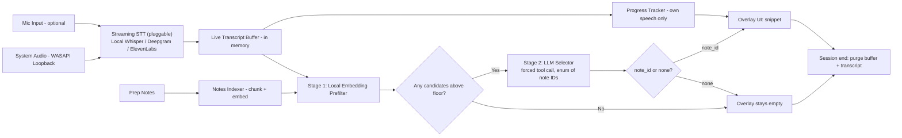

# Interview Prep Recall — Requirements & Build Plan

**Platform:** Windows desktop app
**Display:** Always-on-top overlay, same screen
**Video call compatibility:** Platform-agnostic (captures system audio, not tied to Zoom/Meet/Teams APIs)

**This is the original product plan and is superseded where noted.** `docs/implementation/01-requirements.md`
supersedes §6/§7 below (see its Supersession Notes) and `docs/implementation/07-context-sources-and-report.md`
reverses this doc's "no persistence" guardrail (§4) and "not a summary tool" non-goal (§3) — a
persisted encrypted transcript and a post-interview report both shipped in M10/M11, by decisions
D-U8/D-U9. Epic G (§8, marked "stretch") also shipped as core v1, by D-U1. Treat this file as
historical intent; `docs/implementation/06-progress.md` is the current source of truth.

---

## 1. Problem

Thorough interview prep (background, STAR stories, anticipated Q&A, company research) doesn't reliably translate into live recall under pressure. This is a known ADHD-related executive function challenge (working memory retrieval under time pressure and cognitive load), not a knowledge gap, and it's already cost missed points in real interviews.

## 2. Solution

A Windows app that:
1. Listens to system audio during a live video interview (any platform, since it captures at the OS level)
2. Transcribes the conversation in real time, in memory only
3. Matches what's being asked against the user's own pre-written prep notes
4. Surfaces the matching note as a short, glanceable overlay snippet
5. Discards all audio and transcript data the moment the session ends

## 3. Goals / Non-Goals

**Goals**
- Cut the cognitive load of searching your own notes live
- Work regardless of which video app is used
- Zero persistent recording of interview content
- Overlay is fast to scan, not something you have to read paragraphs of mid-sentence

**Non-goals**
- Not a post-call meeting-notes/summary tool (different product, Granola already does that well)
- Not a technical-answer generator or research tool. It never produces content the user didn't already write.
- Not built for use in someone else's interview, or without the user's own knowledge/consent of what's being captured

## 4. Design Principles (hard guardrails, not just preferences)

| Principle | What it means in practice |
|---|---|
| Retrieval-only | The matching engine may only return text that exists verbatim (or lightly trimmed) in the user's own notes. If nothing clears the relevance threshold, the overlay shows nothing rather than guessing. |
| No persistence | Audio buffers and transcripts exist in RAM for the active session only. Hard-purged on session end or app close. Nothing is written to disk except the notes the user typed in ahead of time. |
| Local-first | Audio and transcript processing happen on-device by default. This also matters independent of privacy preference: many employers ask candidates not to share interview questions externally, and on-device processing means live question content never leaves the machine. |
| No app integration required | Capture happens at the OS audio layer, so it works the same whether the call is Zoom, Meet, Teams, or anything else, with no per-platform maintenance. |

*Cloud STT (§10a) and the LLM matching call (§10b) are both exceptions to Local-first: transcribed audio and question text are sent to a third-party API. Cloud STT is opt-in; the LLM matching call is on by default now, since that's the direction you've chosen, so it's worth treating as a deliberate decision rather than something to drift into. Either path is covered by the indicator in FR20.*

## 5. Primary User

Job-seeking candidate, ADHD, does substantial written interview prep in advance, has had prepared material fail to surface in the moment during live interviews. Comfortable with a technical setup (installing a Windows app, granting audio permissions).

## 6. Functional Requirements

**Notes & Prep**
- FR1: Import prep notes via paste or file upload. Primary formats: `.txt` and `.md` (Day 1). `.docx` support is secondary, added after the core pipeline works.
- FR2: Structure notes as discrete chunks (one anticipated question → one prepared answer/story). For `.md` files, use headers (`##`/`###`) as the default chunk boundary. For `.txt`, split on blank lines or an explicit `Q:`/`A:` convention. All auto-split chunks are editable before saving (FR3).
- FR3: Edit/delete/reorder notes between sessions
- FR4: Tag notes (e.g., "leadership," "conflict," "technical background") for better matching and for the progress tracker (FR12)

**Audio Capture**
- FR5: Capture system audio output (WASAPI loopback) so interviewer speech is picked up regardless of video app
- FR6: Optionally capture microphone input separately, to distinguish the user's own speech from the interviewer's (needed for FR12)
- FR7: Start/stop capture explicitly via a visible control; capture is never silently running in the background

**Transcription & Matching**
- FR8: Stream captured audio to a real-time speech-to-text engine, processed in rolling chunks (~2–4s)
- FR9: Run each transcribed utterance through a two-stage matching pipeline (§10b): a fast local embedding prefilter, then an LLM call that selects among the prefiltered candidates.
- FR10: The matching LLM call is structurally constrained, not just prompted, against fabrication: its only valid output is one note ID from the currently loaded notes, or "none", enforced via a forced tool call with an enum schema. It cannot return freeform text under any circumstances.

**Overlay UI**
- FR11: Frameless, always-on-top overlay window styled as a teleprompter (dark semi-transparent panel, high-contrast light text, minimal chrome), showing the matched note as a short snippet (headline + 1-3 bullet points, not paragraphs). Full appearance controls in FR22-27.
- FR12: Optional progress tracker: checklist of key prepared talking points, marked "mentioned" based on the user's own transcribed speech (from FR6)
- FR13: Manual controls: pause capture, dismiss current snippet, pin a snippet so it doesn't auto-clear (appearance controls — position, size, opacity — are FR22-27 below)
- FR14: Overlay is excluded from screen capture (Windows `SetWindowDisplayAffinity` / `WDA_EXCLUDEFROMCAPTURE`), so if the user ever screen-shares for an unrelated reason (e.g., portfolio walkthrough), personal notes don't leak into the share. This is the software equivalent of a paper note beside the monitor being naturally invisible on a screen share.

**Session Lifecycle**
- FR15: "End session" (manual or on app close) immediately clears audio buffers and transcript from memory
- FR16: No transcript, recording, or audio file is ever written to disk under default settings

**STT Backend Selection**
- FR17: STT runs behind a common streaming interface so the backend (local or cloud) is swappable without changing the rest of the pipeline
- FR18: Default backend is local (`faster-whisper`). Cloud backends (Deepgram, ElevenLabs) are opt-in, enabled by entering an API key in settings
- FR19: API keys are stored in Windows Credential Manager, never in a plaintext config file
- FR20: A persistent, unmissable on-screen indicator shows whenever data is leaving the device, whether that's cloud STT audio or the LLM matching call's question text, distinct from the normal capture indicator (FR-B2/US-B2)
- FR21: If the cloud connection drops mid-session, the app automatically falls back to the local backend rather than going silent, and surfaces a brief notice that it did so

**Overlay Appearance & Persistence**
- FR22: User can drag the overlay to any position on screen. Default position is top-center, near where a laptop webcam typically sits, so glancing at it stays close to the camera's eyeline
- FR23: User can resize the overlay (drag edges or a settings control); text scales with window size so it stays readable rather than clipping or shrinking to illegibility
- FR24: User can adjust overlay opacity on a continuous scale (e.g., 20%-100%), independent of size and position
- FR25: When a new snippet replaces the current one, it transitions in (fade/slide) rather than popping abruptly, consistent with teleprompter-style continuity
- FR26: Overlay position, size, and opacity persist between sessions, stored locally as app settings. This is separate from the no-persistence principle in §4, which applies to audio/transcript content only, not UI preferences
- FR27: A "lock position" toggle prevents accidental dragging once the user has the overlay set up the way they want, useful mid-interview

## 7. Non-Functional Requirements

- Latency: under ~2-3 seconds from interviewer speech to overlay update on local STT; cloud backends should comfortably beat this (see §10a)
- Runs on a typical Windows laptop without requiring a discrete GPU
- Overlay CPU/GPU footprint low enough not to visibly affect video call performance
- Minimum OS: Windows 10 build 19041+ (needed for the capture-exclusion API in FR14)
- Cloud backend, if enabled, requires a stable internet connection for the duration of the session; local backend has no such dependency
- Cloud backend usage incurs a small per-minute cost, billed to the user's own API key (roughly $0.30-0.35 for a 45-minute session, see §10a)
- Matching LLM calls add roughly a few hundred ms each on top of STT latency; budget for this within the overall 2-3s target. Cost is a few cents per full interview at Haiku-tier pricing (§10b)
- The matching LLM requires internet connectivity regardless of which STT backend is chosen. Local STT no longer implies a fully offline session, since matching now depends on an API call by default

## 8. User Stories

### Epic A: Prep & Notes
- **US-A1**: As a candidate, I want to paste or upload my prep notes before an interview, so the tool has material to draw from.
  *AC: accepts pasted text, .txt, .md, .docx; parses into discrete chunks; user can review/edit the parsed chunks before saving.*
- **US-A2**: As a candidate, I want to tag notes by theme, so matching and the progress tracker are more accurate.
- **US-A3**: As a candidate, I want to maintain multiple separate note sets (e.g., per company/role), so prep for one interview doesn't clutter another.

### Epic B: Session Setup
- **US-B1**: As a candidate, I want to pick which note set is active before starting a session, so the right prep is loaded.
- **US-B2**: As a candidate, I want a visible, unmistakable indicator when capture is running, so I always know when audio is being processed.
- **US-B3**: As a candidate, I want to test my audio capture setup before a real call, so I'm not debugging it live.

### Epic C: Live Capture & Transcription
- **US-C1**: As a candidate, I want the app to pick up interviewer audio regardless of which video app I'm using, so I don't need per-platform setup.
- **US-C2**: As a candidate, I want transcription to keep up in near real time, so suggestions are still relevant when they appear.
- **US-C3**: As a candidate, I want the app to tell me clearly if audio capture fails or drops, so I'm not silently unassisted mid-interview.

### Epic D: Retrieval & Surfacing
- **US-D1**: As a candidate, I want the most relevant prepared note to appear automatically when a related question is asked, so I don't have to search for it myself.
- **US-D2**: As a candidate, I want the overlay to stay empty when nothing in my notes is relevant, so I'm never shown a guess.
- **US-D3**: As a candidate, I want to adjust how aggressively the tool surfaces matches (more/fewer, higher/lower confidence), so I can tune it to how much I personally need.

### Epic E: Overlay UX
- **US-E1**: As a candidate, I want the overlay to show short bullets, not full paragraphs, so I can absorb it at a glance without breaking eye contact for long.
- **US-E2**: As a candidate, I want to reposition, resize, and adjust the transparency of the overlay independently, so it fits my screen layout, my monitor, and how much it should blend into the background.
- **US-E3**: As a candidate, I want to pin a note on screen manually, so I can keep something visible longer than the auto-timeout.
- **US-E4**: As a candidate, I want the overlay excluded from anything I screen-share, so my personal notes never leak if I share my screen for something else.
- **US-E5**: As a candidate, I want the overlay to look and feel like a teleprompter (dark panel, high-contrast text, smooth transitions), so it's fast to read at a glance instead of looking like a debug console.
- **US-E6**: As a candidate, I want my position/size/opacity settings remembered between sessions, so I'm not reconfiguring the overlay before every interview.
- **US-E7**: As a candidate, I want to lock the overlay's position once it's set up, so I don't accidentally drag it mid-interview.

### Epic F: Privacy & Session Lifecycle
- **US-F1**: As a candidate, I want all audio and transcript data wiped the moment I end a session, so nothing about the conversation persists anywhere.
- **US-F2**: As a candidate, I want confirmation that nothing was written to disk during a session, so I can trust the "no recording" behavior.
- **US-F3**: As a candidate, I want a single visible "panic clear" control that instantly wipes the current session, for peace of mind.

### Epic G: Progress Tracking (stretch)
- **US-G1**: As a candidate, I want to see which of my key talking points I've already mentioned (based on my own speech), so I know what's still left to cover.
- **US-G2**: As a candidate, I want this tracking based only on my own mic input, not the interviewer's audio, so it reflects what I've actually said.

### Epic H: STT Backend Choice
- **US-H1**: As a candidate, I want to optionally plug in a Deepgram or ElevenLabs API key, so I can get lower latency or higher accuracy than the local default.
  *AC: key entered once in settings, stored via Windows Credential Manager, never shown in plaintext again.*
- **US-H2**: As a candidate, I want a clear, persistent indicator when cloud STT is active, so I always know when audio is leaving my device.
- **US-H3**: As a candidate, I want the app to fall back to local transcription automatically if my cloud connection drops, so a network hiccup doesn't leave me unassisted mid-interview.

## 9. Technical Architecture



**Components**
1. **Audio Capture** — WASAPI loopback (system output) + optional separate mic stream
2. **Streaming STT** — chunked real-time transcription, in memory only
3. **Notes Indexer** — chunks + embeds the user's prep notes at import time
4. **Retrieval Engine** — embedding similarity (or constrained LLM classifier, see FR10) between live transcript and notes index
5. **Overlay UI** — frameless always-on-top window, capture-excluded
6. **Session Manager** — lifecycle, purge-on-end, panic clear

## 10. Recommended Tech Stack

Single-language stack (Python) to keep the build coherent for iterative development:

| Layer | Recommendation | Why |
|---|---|---|
| Audio capture | `pyaudiowpatch` (WASAPI loopback fork of PyAudio) | Purpose-built for Windows "what you hear" capture |
| STT | Pluggable: `faster-whisper` (local, default) or cloud (Deepgram / ElevenLabs) behind a common streaming interface | Local keeps audio on-device by default; cloud is an opt-in upgrade path, see §10a |
| Embeddings | `sentence-transformers` (`all-MiniLM-L6-v2`, local) | Stage 1 prefilter stays fully local and fast; only candidates that pass this filter reach the LLM call in stage 2 |
| Matching LLM | `claude-haiku-4-5-20251001` via the Anthropic Messages API, forced tool call | Fast, cheap, and forced `tool_choice` + an enum schema gives a structural (not just prompted) guarantee against fabrication, see §10b |
| Overlay UI | `PySide6` (Qt) | First-class support for frameless/translucent/click-through/always-on-top windows; `ctypes` gives direct access to `SetWindowDisplayAffinity` for FR14. `setWindowOpacity()` covers FR24, `QSettings` covers FR26 (persists to the Windows registry, no separate config file needed), and drag-to-reposition (FR22) needs manual `mousePressEvent`/`mouseMoveEvent` handlers since a frameless window has no native title bar to drag by default |
| Packaging | `PyInstaller` | Single-exe distribution |

### 10a. STT Backend Comparison

| | Local (`faster-whisper`) | Deepgram (Nova-3, streaming) | ElevenLabs (Scribe v2 Realtime) |
|---|---|---|---|
| Latency | ~2-3s on typical CPU (unverified until Phase 2 test) | Sub-300ms | ~150ms |
| Cost | Free (compute only) | ~$0.0077/min (~$0.46/hr); $200 free credit ≈ 430 hrs | ~$0.0067/min (~$0.40/hr) |
| Data handling | Never leaves the device | Sent to Deepgram's servers; check current retention terms before use | Sent to ElevenLabs' servers; Zero Retention mode available (SOC 2 / HIPAA / GDPR, EU residency option), but audio is still transmitted and processed live even in that mode |
| Reliability | No network dependency | Needs a stable connection; reconnect/recovery logic has to be built by the app, not automatic | Needs a stable connection; handles reconnects more gracefully per their docs |
| Setup complexity | Bundled model, no account needed | API key, WebSocket integration | API key, WebSocket integration |

**Recommendation:** default to local for the reasons in §4 (Local-first). Treat cloud as an explicit, user-initiated upgrade for people who hit local latency/accuracy problems on their hardware, gated behind FR18-FR21 (opt-in, clear indicator, secure key storage, auto-fallback).

### 10b. Matching Engine (Local Prefilter + Constrained LLM Selection)

Two stages, run on every transcribed utterance:

1. **Local prefilter (always on, no network call).** Embed the utterance with `sentence-transformers`, compare against all note embeddings, take the top 3-5 candidates above a low floor threshold. Near-instant; filters out silence and small talk before anything reaches an LLM.
2. **LLM selection (only if stage 1 returns candidates).** Send the utterance plus the candidate note snippets (with IDs) to `claude-haiku-4-5-20251001`, with one tool defined and `tool_choice` forced to it:

```python
tools = [
    {
        "name": "select_note",
        "description": "Select the single best-matching prepared note for the live question, or none.",
        "input_schema": {
            "type": "object",
            "properties": {"note_id": {"type": "string", "enum": [*current_note_ids, "none"]}},
            "required": ["note_id"],
        },
    }
]

response = client.messages.create(
    model="claude-haiku-4-5-20251001",
    max_tokens=50,
    tools=tools,
    tool_choice={"type": "tool", "name": "select_note"},
    messages=[
        {"role": "user", "content": f"Live question: {utterance}\n\nCandidates:\n{candidate_notes}"}
    ],
)
```

Forcing `tool_choice` to this tool means Claude can only return a note ID drawn from the enum you populated with the user's own note IDs, or `"none"`. It structurally cannot emit freeform text, which is what makes FR10 an architectural guarantee rather than a prompting convention.

**On LLM call failure or timeout:** fall back to the top stage-1 embedding match directly (skip refinement) rather than showing nothing, same fallback philosophy as FR21.

**Cost/latency:** a candidate's prep notes are typically a few thousand words, so each call is a few hundred input tokens and a handful of output tokens. At current Haiku-tier pricing (roughly $1/$5 per million tokens, worth confirming the live rate before shipping) a full interview's worth of matching calls costs a few cents. Round-trip latency is typically a few hundred ms, on top of whatever the STT backend adds.

**If fully local matching matters more than LLM quality:** a small open-weight model run locally (e.g., via Ollama) can follow the same forced-selection pattern for runtimes that support constrained output, at the cost of weaker judgment and likely slower response on a typical laptop. Not the default recommendation here, since you've opted for an LLM in the loop, but worth knowing it's an option if the always-on API dependency becomes a problem later.

## 11. Build Plan for Claude Code (phased)

Each phase is a self-contained milestone that can be handed to Claude Code as its own prompt.

1. **Audio pipeline spike** — WASAPI loopback capture working standalone, live waveform/volume printed to console, nothing else. Validates the core capture assumption before building anything on top of it.
2. **Streaming transcription (pluggable)** — define a common streaming-STT interface first. Fastest way to de-risk the rest of the pipeline: wire up Deepgram or ElevenLabs first (proven low latency, quick integration), confirm transcript quality and timing end-to-end, then add `faster-whisper` behind the same interface as the local/default backend. Print live transcript to console either way and measure real latency on your actual hardware.
3. **Notes ingestion + indexing** — CLI or minimal UI to import/edit notes, chunk into Q/A-style items, embed and store in an in-memory index.
4. **Matching engine (two-stage)** — implement the local embedding prefilter first, log candidates to console. Then add the LLM selector call (forced tool choice, enum schema per §10b), log the selected note ID (or "none") to console. Still no overlay yet; this phase is about proving the matching logic end-to-end.
5. **Overlay UI** — build the frameless/translucent/always-on-top teleprompter-style window (FR11, FR22-27: drag-to-reposition, resize, opacity, transitions, `QSettings`-backed persistence, lock toggle), wire it to matching engine output, implement capture exclusion (FR14) and session controls (FR13).
6. **Session lifecycle & purge** — start/stop session, hard in-memory purge on end, panic-clear control, verify nothing touches disk.
7. **Progress tracker (stretch)** — mic-only speech tracking against tagged notes, "mentioned" checklist in the overlay.
8. **Polish & packaging** — settings (threshold, font size, position, opacity), first-run setup wizard, `PyInstaller` build.

## 12. Open Questions / Risks

- **The LLM matching call is a hard dependency now, not an optional upgrade.** Unlike cloud STT (opt-in), sending transcribed question text to an LLM API happens by default under this design. Worth confirming that's the trade-off you want, versus a local small model for matching if keeping everything fully on-device matters more than match quality (§10b).
- **Local STT latency on your actual hardware is unverified.** Phase 2 will tell you quickly whether `faster-whisper` on CPU hits the ~2-3s target; cloud is now a documented fallback if not (§10a).
- **Speaker separation without diarization.** Distinguishing "interviewer asked X" from "I said Y" relies on loopback vs. mic being separate streams, not on true diarization. Should hold up for most single-interviewer calls, worth stress-testing on panel interviews.
- **Windows version dependency.** FR14 (capture exclusion) needs Windows 10 19041+; worth confirming your machine meets this early.
